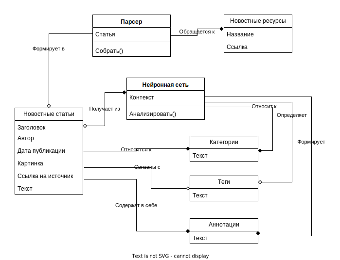

# Концептуальная модель IT News

## Компоненты системы:

### Веб-Сервер
* `Веб-Сервер` - компонент, отвечающий за обработку запросов и обмен данными с другими компонентами.

### База Данных
* `База Данных` - хранит данные новостных статей и пользовательские данные.

### Пользовательский Интерфейс
* `Пользовательский Интерфейс` - обеспечивает взаимодействие пользователей с системой, позволяет отправлять запросы.

### Модуль Управления Новостями
* `Модуль Управления Новостями` - отвечает за управление новостями, их отображение и взаимодействие с ними.

### Модуль Поиска
* `Модуль Поиска` - выполняет поисковые запросы и обеспечивает результаты поиска.

### Сервис
* `Сервис` - компонент для обмена данными с внешними системами и веб-сервером.

### Сервис парсинга
* `Сервис парсинга` - получает данные и отправляет их для парсинга.

### Сервис аннотирования
* `Сервис аннотирования` - получает данные статьи и передает их в искусственный интеллект для аннотирования.

### Парсер
* `Парсер` - компонент для сбора новостей.

### Парсер новостного ресурса
* `Парсер новостного ресурса` - выполняет сбор данных о новостях.

### Искусственный интеллект
* `Искусственный интеллект` - обрабатывает данные статьи и предоставляет аннотации.

## Связи между компонентами:

* `База Данных` хранит данные новостных статей и пользовательские данные.
* `Веб-Сервер` имеет доступ к данным в базе данных и обрабатывает запросы пользователей.
* `Пользовательский Интерфейс` позволяет пользователям взаимодействовать с системой, отображать новости и отправлять поисковые запросы.
* `Модуль Управления Новостями` отвечает за управление новостями и взаимодействие с ними.
* `Модуль Поиска` выполняет поисковые запросы пользователей.
* `Сервис` обменивается данными с веб-сервером.
* `Сервис парсинга` отправляет данные в `ПарсерBase` для обработки.
* `ПарсерBase` включает несколько `ПарсерUnit`, которые выполняют сбор новостей.
* `Сервис аннотирования` отправляет данные в `Искусственный интеллект` для аннотирования статей.
