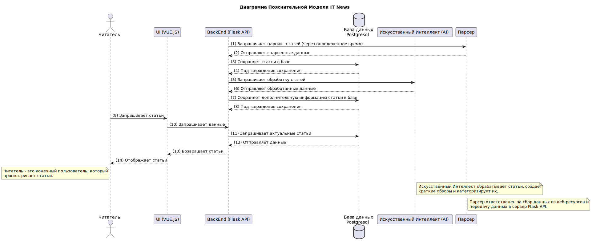

# Диаграмма последовательностей IT News

Диаграмма пояснительной модели IT News наглядно представляет взаимодействие между ключевыми компонентами системы.

### **1. Читатель (Пользователь)**
- **Действие**: Пользователь начинает взаимодействие с системой, запрашивая статьи.
- **Роль**: Инициирующий актор, требующий контента.

### **2. Интерфейс Пользователя (UI)**
- **Действие**: UI принимает запрос от пользователя и направляет его на сервер Flask API для обработки.
- **Роль**: Активный посредник между пользователем и системой.

### **3. Сервер Flask API (BackEnd)**
- **Действия**:
  - Запрашивает данные из базы данных PostgreSQL.
  - Обрабатывает данные, используя искусственный интеллект (AI) для создания кратких обзоров и категоризации.
  - Обращается к парсеру для получения дополнительных данных.
  - Сохраняет статьи в базе данных и возвращает их UI для отображения.
- **Роли**:
  - **Контролирующий**: Координирует все этапы обработки статей.
  - **Агент обработки данных**: Производит обработку и категоризацию статей.

### **4. Искусственный Интеллект (AI)**
- **Действие**: Обрабатывает статьи, создает краткие обзоры и категоризирует контент.
- **Роль**: Интеллектуальный агент, обогащающий статьи и делая их более удобными для чтения.

### **5. Парсер**
- **Действие**: Отвечает за сбор данных из веб-ресурсов.
- **Роль**: Поставщик данных, обеспечивающий сервер Flask API актуальной информацией.

----

