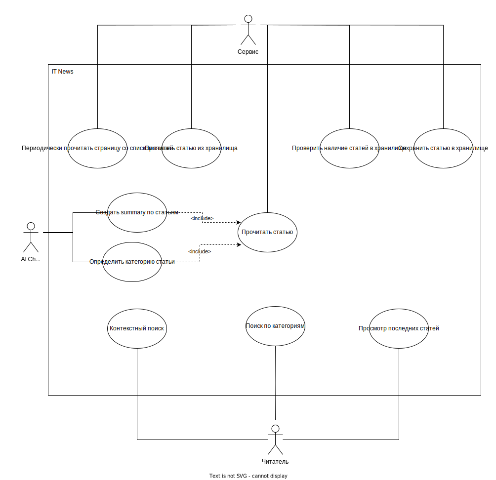

# Описание UML Use Case Диаграммы IT News

Диаграмма Use Case "IT News" моделирует взаимодействие пользователей и системы в рамках веб-приложения для чтения новостей о технологиях.

---

### 1. Использование веб-платформы

#### 1.1 Просмотр последних статей
- **Описание:** Пользователь может просматривать список последних опубликованных статей на веб-сайте.
- **Действие:** Пользователь выбирает опцию "Просмотр последних статей" и видит список свежих новостей.

#### 1.2 Поиск по категориям
- **Описание:** Пользователь имеет возможность искать статьи по определенным категориям или темам.
- **Действие:** Пользователь выбирает определенную категорию (например, "Искусственный Интеллект") и получает список статей, связанных с этой темой.

#### 1.3 Контекстный поиск
- **Описание:** Пользователь может вводить ключевые слова или фразы для поиска конкретной информации.
- **Действие:** Пользователь вводит ключевые слова (например, "Интернет вещей") и получает результаты, соответствующие запросу.

### 2. Система "IT News"

#### 2.1 Сервисы Обработки данных
- **Описание:** Система включает в себя сервисы, обрабатывающие данные и обеспечивающие функциональность веб-приложения.
- **Детали:**
  - *Сохранение статьи в хранилище:* Обеспечивает сохранение новых статей в базе данных для последующего отображение на ресурсе.
  - *Чтение статьи из хранилища:* Позволяет веб-платформе получать содержимое сохраненных статей.
  - *Создание summary по статьям:* Автоматически генерирует краткое описание статей для облегчения понимания содержания.
  - *Определение категории статьи:* Автоматически определяет тематическую принадлежность статьи (например, "Технологии" или "Искусственный Интеллект").

#### 2.2 Дополнительные Сервисы
- **Описание:** Система включает в себя сервис, отвечающий за мониторинг новых статей и обновлений в хранилище данных.
- **Детали:**
  - *Периодическое чтение страницы со списком статей:* Система регулярно сканирует веб-сайты для выявления новых статей.
  - *Проверка наличия статей в хранилище:* Предотвращает дублирование статей в базе данных.
  - *Чтение конкретной статьи:* Получает полный текст статьи для сохранения и отображения пользователям.

### 3. Взаимодействие с Искусственным Интеллектом (AI ChatGPT)

- **Описание:** Система взаимодействует с искусственным интеллектом для повышения уровня сервиса для пользователей.
- **Детали:**
  - *Создание summary по статьям:* Искусственный интеллект автоматически формирует краткие обзоры содержания статей для быстрого ознакомления.
  - *Определение категории статьи:* Искусственный интеллект определяет тематическую принадлежность статей, облегчая пользователям поиск по интересующим темам.
 
---

