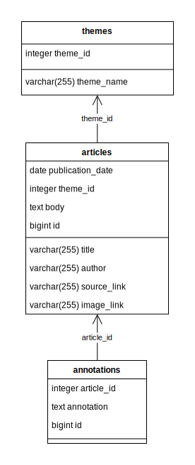

## Структура БД

----
## Записи из таблицы articles

| id | title | publication\_date | author | theme\_id | source\_link | image\_link | body |
| :--- | :--- | :--- | :--- | :--- | :--- | :--- | :--- |
| 1 | New chips introduced by Microsoft to compete for AI dominance | null | Ernestas Naprys | null | https://cybernews.com/tech/new-chips-introduced-microsoft-compete-for-ai-dominance/ | https://media.cybernews.com/images/thumbnail/2023/11/rack.jpg | Microsoft has unveiled two new chips tailored for AI workloads, enabling the tech giant to complete the puzzle of complete infrastructure systems delivery. The first custom-designed silicon chip, the Microsoft Azure Maia 100, is optimized for artificial intelligence \(AI\) tasks. With the new Maia 100 accelerators, Microsoft hopes to power its largest internal AI workloads. Future designs may be adopted according to feedback provided by OpenAI, which is developing popular ChatGPT and other large language models. The Maia 100 includes 105 billion transistors, making it one of the largest chips built on 5nm process technology. For comparison, Nvidia’s top-notch chip H200 has 80 billion transistors but is built on the more advanced 4-nanometer node. AMD’s MI300A chip has 146 billion transistors. The other processor, Cobalt 100, is Arm-based, fit to run general-purpose compute workloads on the Microsoft Cloud. The Cobalt 100 CPU, the first generation in the series, is designed with great energy efficiency in mind, optimizing “performance per watt.” Microsoft’s data centers in Quincy, Washington, are the first to be powered by the new chip. Microsoft touts that its 64-bit 128-core chip delivers an “up to 40 percent performance improvement over current generations of Azure Arm chips.” “The chips will start to roll out early next year to Microsoft’s data centers, initially powering the company’s services such as Microsoft Copilot or Azure OpenAI Service,” the company announced in its annual Ignite conference. |
| 2 | Spotify to employ Google’s AI to enhance content discovery | null | Ernestas Naprys | null | https://cybernews.com/tech/spotify-google-cloud-ai-discovery/ | https://media.cybernews.com/images/thumbnail/2023/11/rack.jpg | Spotify, the popular music streaming service, said it will employ Google’s large language models \(LLMs\) to analyze its content library for sharper content recommendations. Spotify, a popular audio content streaming platform, has been pioneering curated content segments for years, with tailor-made playlists like Discover Weekly and Release Radar. Now, it seems the Stockholm-based platform wants to improve its podcast and audiobook sections. Spotify has announced it will “explore using” Google Cloud’s AI tools to better understand its content library and provide users with more accurate recommendations. It’s hardly a surprise that Spotify sides with Google in its AI applications, as the streaming platform has been using Google Cloud to store its content since 2016. “Spotify is exploring LLMs to better understand the breadth of its content library and augment the metadata used to present this content to users every day,” the platform said in a joint statement with Google Cloud. As the platform tries to consolidate its position in podcast and audiobook distribution, artificial intelligence and machine learning may also serve as a tool for sharper personalized recommendations. The company said that AI could be used to understand its 5 million podcasts and 200,000 audiobooks library, as well as user listening patterns to present new recommendations. The platform also said that AI could be employed to “identify potentially harmful content.” Spotify has been increasingly pushing the adoption of AI to recommend content for its users. At the start of 2023, the platform debuted an AI DJ, which gives a lineup of music based on user preferences and provides information about the music using generative AI. More recently, bloggers noticed parts of Spotify’s code including hints that it may soon introduce a new feature allowing users to generate playlists on the fly using AI and custom prompts. AI and custom prompts |
| 3 | TikTok repels claims of anti-Israel bias, finds similar situation on Facebook | null | Vilius Petkauskas | null | https://cybernews.com/tech/tiktok-repels-claims-of-anti-israel-bias/ | https://media.cybernews.com/images/thumbnail/2023/10/spotify-podcast-streaming.jpg | After renewed calls to ban TikTok in the US for pushing young people to support the Palestinian cause, the 1 billion wide social media platform has released further information on its policies. Its comparison with a rival suggests that the situation is similar on Facebook. TikTok says it removes 100% of antisemitic or Holocaust denial content reported by Fighting Online Antisemitism. The popular short-form video app TikTok shared some more statistics and information to defend itself from recent criticism and calls to ban the platform for its supposed stance in the Palestinian-Israeli conflict. Powerful US politicians recently blamed TikTok for its content moderation policies. Senator Marco Rubio released a press release claiming “China’s TikTok Pushes Pro-Hamas Propaganda.” press release Senator Josh Hawley \(R-MO\) said in an open letter that the parent company ByteDance threatens American national security, urging to review and ban all its controlled apps currently available to US users. According to the New York Times, Republican lawmakers are again calling to ban TikTok amid accusations that it is amplifying pro-Palestinian and anti-Israel videos through its powerful algorithmic feed. letter again calling to ban TikTok TikTok responded on Monday with a second announcement, claiming that its algorithm doesn’t “take sides” and has rigorous measures to prevent manipulation. The company says it responds rapidly and robustly to the war in the Middle East. “Blunt comparisons of hashtags are severely flawed and misrepresentative of the activity on TikTok,” the post reads. post TikTok asserts that millions of people in regions such as the Middle East and South East Asia account for a significant proportion of views on hashtags. Therefore, there’s more content with #freepalestine and #standwithpalestine and overall views. And hashtags alone don’t tell the whole story. “For example, the hashtag #standwithIsrael may be associated with fewer videos than #freePalestine, but it has 68% more views per video in the US, which means more people are seeing the content. And, some hashtags are newer \(e.g. #standwithIsrael\) while others are more established \(e.g. #freePalestine\) – the vast majority \(9 in 10\) of videos tagged #standwithIsrael were posted in the last 30 days in the US. A difference in views and posts is expected,” the company said. In addition to proactive efforts to remove hate speech, TikTok claims it removed 100% of antisemitic or Holocaust denial content Fighting Online Antisemitism reported through Community Partner Channel last year. “Nine times out of ten, TikTok removes hate speech before it's reported.” TikTok also provided a comparison of overall post counts, showing that other platforms, such as Instagram and Facebook, also have much more content for #FreePalestine than #standwithIsrael. However, the ratio between the post-count for #freepalestine and #standwithisrael is around 77 to 1 on TikTok, and correspondingly, it is 27 to 1 on Instagram and 40 to 1 on Facebook, the provided comparison shows. |
| 4 | Tesla backtracks on controversial fines for Cybertruck resellers | null | Ernestas Naprys | null | https://cybernews.com/tech/tesla-backtracks-on-controversial-fines-for-cybertruck-resellers/ | https://media.cybernews.com/images/thumbnail/2023/08/TIKTOKpoll.jpg | After a backlash, Tesla has updated its terms and conditions for Cybertruck buyers. Those no longer include a specific “no-reselling” clause, removing the risk of getting a $50,000 fine if the vehicle is sold within the first year of purchase. Tesla’s Motor Vehicle Order Agreement no longer includes the Cybertruck section, which previously stated buyers' obligations regarding reselling the vehicle. Cybernews reported that Cybertruck buyers must agree that they will not sell or attempt to sell the vehicle within the first year. If not, Tesla could “seek injunctive relief to prevent the transfer of title of the Vehicle or demand liquidated damages from you in the amount of $50,000 or the value received as consideration for the sale or transfer, whichever is greater.” reported that Tesla’s move has been widely criticized on social media. Many reviewers claimed, “You don’t own what you can’t sell,” raising questions on the legality of enforcing such a clause.  The terms and conditions still include a general “No Resellers” section, stating that Tesla and its affiliates sell cars directly to consumers. Any orders with a goal to resell or otherwise “made in bad faith” may be unilaterally canceled. Tesla would keep the order fee, order deposit, and transportation fee in that case. terms and conditions The first Cybertruck delivery event will take place at Gigafactory Texas on November 30th, marking the start of shipments. Tesla has not yet revealed the Cybertruck’s pricing. While not common, some car makers of rare and expensive vehicles use restrictive agreements to limit reselling cars such as Ferrari or Porsche, according to electrek.co. However, Cybertrucks will be mass-produced in the capacity of 125,000 per year at the Gigafactory Texas. Its price was touted to start from around $40,000 back in 2019. |
| 5 | Airbus patents device to halt satellite tumbling | null | Ernestas Naprys | null | https://cybernews.com/tech/airbus-patents-device-to-halt-satellite-tumbling/ | https://media.cybernews.com/images/thumbnail/2023/10/Tesla.jpg | Airbus will soon test a device to prevent satellites from tumbling after their end-of-life. Debris removal missions will face greater challenges if spacecraft are tumbling, Airbus says. Essentially, a tumbling satellite is rotating in an uncontrolled manner – it can’t maintain a stable and predictable orientation in space. Eventually, it can fall out of orbit and re-enter the Earth’s atmosphere. Airbus’ Detumbler device is designed to prevent satellites at the end of their lives from tumbling. It’s a magnetic damping device weighing in at around 100g that would be attached to the satellite. “The Detumbler includes a central rotor wheel and magnets that interact with the Earth’s magnetic field. When the satellite is flying normally, the rotor acts like a compass following the magnetic field, but should the spacecraft begin to tumble, the rotor movement induces eddy currents acting like a friction torque, thus damping the motion,” Airbus explained. The device will be tested early next year. Over 8,000 satellites currently orbit the Earth. There have been no confirmed instances of a satellite debris collision with an airplane. However, such an occurrence is becoming more likely. As The Conversation pointed out in a comprehensive report on the risks of airplanes clashing with space debris, satellites are launched using rockets. Some of them are brought back in a controlled manner, while others are abandoned in orbit. The Conversation |
| 6 | Electric air taxi 'quietly' completes first test run in NYC | null | Jurgita Lapienytė | null | https://cybernews.com/tech/electric-air-taxi-evtol-joby-first-test-nyc/ | https://media.cybernews.com/images/thumbnail/2023/11/Airbus-detumbler.png | With zero emissions, zero noise pollution, and seven minutes to JFK airport, it looks like the Joby electric air taxi may win the hearts and minds of the New York City traveler. Forget Uber and Lyft, there’s a new ride coming to New York City – the electric air taxi. Joby Aviation, a developer of the electric vertical take-off and landing \(eVTOL\) aircraft – successfully completed its first test flight in downtown Manhattan. The test flight was the first electric flight in NYC and the first time that Joby Aviation had flown the aircraft in an urban setting. Joby’s eVTOL was specifically developed for commercial passenger service, or in this case specifically for “electric aerial ridesharing.” “We plan to make quiet, emissions-free flight an affordable, everyday reality for New Yorkers while significantly reducing the impact of helicopter noise,” said JoeBen Bevirt, Founder and CEO of Joby Aviation. As part of the test run, New York City’s Mayor Eric Adams announced that the city would be outfitting the Downtown Manhattan Heliport with electric charging stations to accommodate the aircraft – which is planning a 2025 launch. “By electrifying one of the most famous heliports in the world, New York is demonstrating global leadership in the adoption of electric air travel,” Bevirt said.  According to Bevirt, it takes only five minutes to recharge the electric aircraft on the landing pad, about the same time it would take to disembark and board new passengers. Once charged, the aircraft uses its electric power to hover, take off, and land vertically. If you’ve ever lived or visited New York City, getting to and from the airport is a daunting task, as public transportation is indirect and time-consuming,, while taxi rides can take even longer depending on traffic conditions. The eVTOL can get you from downtown Manhattan to JFK Airport, one of the main international airports serving the city, in about seven minutes, a far cry from a trip that could easily take 2 hours. What’s more, the cost of the air taxi ride is expected to be similar to other ride sharing apps. Bevirt also thanked Delta Air Lines, who is backing the company’s expansion into the air taxi market by investing in the service infrastructure at both LaGuardia and JFK hubs in New York. |
| 7 | Russia fines Google $164K for not keeping user data inside the country | null | Stefanie Schappert | null | https://cybernews.com/tech/russia-fines-google-for-not-keeping-user-data-inside-country/ | https://media.cybernews.com/images/thumbnail/2023/11/Joby.jpg | A Moscow court imposed 15 million roubles \($164,000\) fine on Google for repeated refusal to store Russian users' data on servers inside Russia. Russia has repeatedly clashed with foreign technology companies over content, censorship, data and local representation in a simmering dispute that intensified after Moscow sent its armed forces into Ukraine in February 2022. Google's Russian subsidiary has been under pressure in Russia for failing to delete content Moscow deems illegal and for restricting access to some Russian media on YouTube. The technology giant's Russian unit filed for bankruptcy in summer 2022 after authorities seized its bank account, making it impossible to pay staff and vendors. However, while the Kremlin has banned some platforms, including Twitter and Facebook, it has not blocked access to Google’s services, and its search engine and YouTube platform, both free, have continued operating. Google did not immediately respond to emailed requests for comment. |
| 8 | Google has had enough: will see copyright and Bard scammers in court | null | Reuters | null | https://cybernews.com/tech/google-will-see-copyright-and-bard-scammers-in-court/ | https://media.cybernews.com/images/thumbnail/2023/07/google-schmoogle.jpg | Scammers are facing lawsuits from Google. The tech giant has found a way to fight fraudsters who are filing bogus copyright claims to take down websites or offering to “download” Bard so they can infect user systems with malware. If successful, it may provide clear mechanisms and deterrents for preventing similar scams in the future. Two groups of scammers, probably consisting of hundreds of individuals and organizations, are about to get busier with litigation after receiving claims from Google. Google believes that lawsuits will be an effective tool for establishing a legal precedent, disrupting the tools used by scammers, and raising the consequences for bad actors. “Today we’re taking action to protect users of Google’s Bard AI as well as against fraudsters who sought to weaponize copyright law for profit,” Google’s blog post reads. blog post reads The first group targets unsuspecting users interested in AI to spread malware. “The fraudsters created social media pages and ran ads that encouraged people to “download” Bard, our freely available generative AI tool that does not need to be downloaded. The ads instead led people to download malware that compromised their social media accounts,” Google said in a blog post. Since April, Google has filed roughly 300 takedowns related to this group of bad actors who misled numerous people around the world. The search engine giant believes that it can get an order to stop scammers from setting up domains and allow them to disable them with US domain registrars. “If this is successful, it will serve as a deterrent and provide a clear mechanism for preventing similar scams in the future,” Google said. The second group weaponized the Digital Millennium Copyright Act \(DMCA\). By filing fraudulent copyright notices from fake accounts, these fraudsters harm business competitors. “Our lawsuit targets bad actors who set up dozens of Google accounts and used them to submit thousands of bogus copyright claims against their competitors. These fraudulent claims resulted in the removal of over 100,000 businesses’ websites, costing them millions of dollars and thousands of hours in lost employee time,” Google noted. The tech giant hopes the lawsuit will deter and put an end to this activity and also raise public awareness. The DMCA was supposed to protect internet users and copyright holders who create and share information online. To comply with DMCA, Google has a takedown process to handle legitimate complaints of copyright infringement. process “Just as AI fraudsters and copyright scammers hope to fly under the radar – we believe that appropriate legal action and working with government officials puts scammers squarely in the crosshairs of justice, promoting a safer internet for everyone.” According to Google, Gmail blocks over 100 million phishing attempts every day, Safe Browsing protects over 5 billion devices, and Google Play scans over 100 billion apps. |
| 9 | TikTok bans one in five videos shared from UK | null | Ernestas Naprys | null | https://cybernews.com/tech/tiktok-uk-ban-one-in-five-videos/ | https://media.cybernews.com/images/thumbnail/2023/10/Googleilluminated.jpg |  TikTok removes a higher proportion of videos put up by users in Pakistan than in any other country, research finds. The UK is also a top five ‘offender’ when it comes to content that breaks the social media platform’s rules. More than seven in ten videos put up by TikTok’s 16.5 million Pakistani users were removed from the Chinese-owned social media platform in the first three months of 2023, family safety app provider AI Digital claims. While it stops short of specifying which country is most guilty of what offense to get user content banned, overall it found that three in ten posts globally were removed due to child safety concerns. Of course, AI Digital has a vested interest in claiming such, and Cybernews could not verify its claims at the time of going to press. Other top offenses noted by the digital safety company between January and March included “illegal activities and regulated goods” \(27.2% of removals\) and “adult nudity and sexual activities” \(14.7%\). The UK has nothing to be proud of either, if AI Digital’s research is anything to go by, as it came in fourth place for countries judged to have the most offensive content by number of users, after Azerbaijan and the Dominican Republic. Just under one in five video posts put up during the research period by British users, who number close to 20 million, were removed by TikTok, which is owned by China-based firm ByteDance. “This data underscores the complexities associated with content moderation on a global scale,” said a Canopy spokesperson. “As a global platform, TikTok grapples with the delicate balance of adhering to local regulations and maintaining a vibrant and diverse content ecosystem.” Praising TikTok’s tough stance on removing videos threatening minors and urging the importance of “region-specific content guidelines,” Canopy said its findings demonstrated “the need for transparent and effective communication between platform operators, content creators, and regulatory authorities.” It added: “As TikTok continues to evolve, it remains imperative for the platform to adapt and refine its content moderation strategies to foster a safe and inclusive environment for users worldwide, particularly vulnerable minors.” Other top offending videos censored by TikTok, as recorded by Canopy, included “violent and graphic content” \(9.1%\), “harassment and bullying” \(5.3%\), and “violent extremism” \(1.4%\). |
| 10 | Tesla forbids Cybertruck buyers to sell for a year or risk $50K fine | null | Damien Black | null | https://cybernews.com/tech/tesla-forbids-cybertruck-buyers-to-sell/ | https://media.cybernews.com/images/thumbnail/2023/03/Shutterstock\_1451827259.png | You shall not sell the Cybertruck. Buyers of Tesla’s long-awaited electric pickup trucks must now sign an agreement prohibiting them from selling them to a third party. Tesla’s updated Motor Vehicle Order Agreements now include a special section for Cybertruck buyers that makes buyers submit to a “no reseller” policy. “You agree that you will not sell or otherwise attempt to sell the Vehicle within the first year following your Vehicle’s delivery date,” the new terms and conditions read. “Tesla may seek injunctive relief to prevent the transfer of title of the Vehicle or demand liquidated damages from you in the amount of $50,000 or the value received as consideration for the sale or transfer, whichever is greater.”  Moreover, Tesla may also refuse wrongdoers to sell you any future vehicles. Deliveries of the Cybertruck are planned to start on November 30th. Buyers who must sell their vehicle sooner due to unforeseen reasons have the option to notify Tesla in writing. If the company agrees that the reason is valid, it will repurchase the vehicle. However, the price will be reduced by $0.25 per mile driven, excluding reasonable wear and tear and the cost of repair to meet Tesla’s cosmetic and mechanical standards. Only if Tesla declines to repurchase the Cybertruck can the owner resell the vehicle to another third party after receiving written consent, the terms state. the terms The new rules note that the Cybertruck will first be released in limited quantities. Tesla’s rules also state that the company and its affiliates sell cars directly to end-consumers, and they may unilaterally cancel any order that they believe has been made with a view toward the resale of any Tesla vehicle. In such cases, Tesla will keep order fees, order deposits, and transportation fees.  That includes orders for which a third party is facilitating or brokering the sale or the vehicle is to be exported somewhere. Resales of Teslas are already complicated due to software features such as self-driving that are linked to user accounts and may not be transferable. Many are unhappy about Tesla’s move to curb resellers. “If you can’t sell it… you don’t own it,” noted Zack Nelson, the owner of the tech review channel JerryRigEverything, on X. Tesla has not yet revealed the Cybertruck’s pricing. The first Cybertruck delivery event will take place at Gigafactory Texas on November 30th. |
